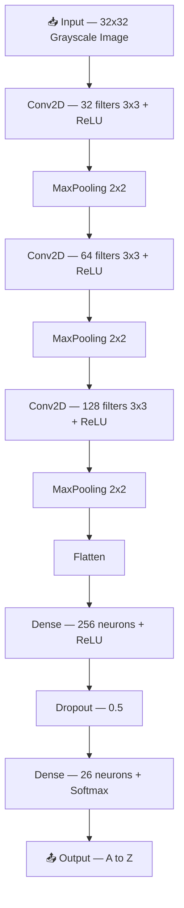

*# ⠃ BrailleVision — Physical Braille to English using Camera AI

> Real-time physical Braille recognition using CNN + OpenCV + Streamlit

[](https://braille-hackathon-rgiodfqrpcjssu6yku77wf.streamlit.app/)
[](https://python.org)
[](https://tensorflow.org)

---

## 🎯 Problem Statement

Braille is the primary reading system for visually impaired people worldwide.
But most people around them — teachers, family members, and caregivers —
cannot read Braille. BrailleVision solves this by instantly converting
physical Braille into spoken English using just a camera.

---

## ✅ What BrailleVision Does

- 📷 Accepts real Braille images via upload or live camera
- 🔬 Uses OpenCV to detect and segment Braille dot cells
- 🧠 CNN model predicts each letter with 99% accuracy
- 🔊 Reads the recognized text aloud using Text to Speech
- 🌐 Deployed as a web app — works on any device

---

## 🛠️ Tech Stack

| Tool | Purpose |
|---|---|
| Python | Programming language |
| TensorFlow / Keras | CNN model training |
| OpenCV | Image processing & dot detection |
| ONNX Runtime | Fast model inference on Streamlit Cloud |
| Streamlit | Web app interface |
| gTTS | Text to speech output |
| Google Colab | Model training with T4 GPU |

---

## 🧠 Model Architecture



### Training Results
- Dataset: 2080 images, 26 classes (A–Z)
- Epochs: 20
- Optimizer: Adam
- Training Accuracy: **99%**
- Validation Accuracy: **100%**

---

## 🔍 How It Works

**Step 1 — Capture**
User uploads a Braille image or scans using live camera.

**Step 2 — Detect**
OpenCV converts image to grayscale, applies thresholding,
detects Braille dot columns and segments each character cell.

**Step 3 — Predict**
Each cell is fed to the CNN model which predicts the letter.
All letters are joined to form the complete text.

**Step 4 — Speak**
gTTS converts the recognized text to speech and plays it aloud.

---

## 🚀 Run Locally

```bash
# Clone the repo
git clone https://github.com/codelovecore23/Braille-Hackathon.git
cd Braille-Hackathon

# Install dependencies
pip install -r requirements.txt

# Run the app
streamlit run app.py
```

---

## 📦 Requirements

streamlit
onnxruntime
opencv-python-headless
gdown
gtts
Pillow
numpy

---

## 📁 Project Structure

```
Braille_Vission_Hackathon/
│
├── app.py                          ← Streamlit web app (main file)
├── requirements.txt                ← Python dependencies
├── README.md                       ← Project documentation
└── braille_vission_hackathon.py    ← Google Colab training notebook
```

> Note: `braille_cnn.onnx` and `reverse_map.json` are auto-downloaded
> from Google Drive at runtime — not stored in the repo.

---

## 📊 Dataset

- Source: Kaggle — Braille Character Image Classification
- Link: https://www.kaggle.com/datasets/mdismielhossenabir/braille-character-image-classification
- Images: 2080 total, 26 classes (A–Z)
- Image size: 50×50 pixels, grayscale

---

## 🔄 What Was Reused

| Item | Source |
|---|---|
| Dataset | Kaggle (mdismielhossenabir) |
| TensorFlow | Open source library |
| OpenCV | Open source library |
| Streamlit | Open source framework |

---

## 🔨 What Was Built During Hackathon

- CNN model architecture and training pipeline
- OpenCV Braille dot detection and cell segmentation
- ONNX conversion for Streamlit Cloud deployment
- Complete Streamlit web app with camera and speech
- Full end-to-end pipeline from image to spoken English

---

## 🌐 Live Demo

👉 **App:** https://braille-hackathon-rgiodfqrpcjssu6yku77wf.streamlit.app/

---

## 👤 Built By

**Miduna Varshini M A**
Solo participant — BrailleVision Hackathon 2026

---

## ♿ Accessibility Impact

BrailleVision helps:
- Teachers working with visually impaired students
- Family members and caregivers
- Healthcare workers
- Anyone who needs to understand Braille instantly

---

*Built with ❤️ for BrailleVision Hackathon 2026*
